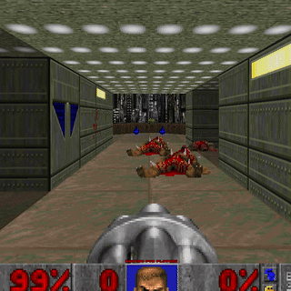

# Emote System

Have you ever wanted to express yourself after getting spawn fragged, but typing something into chat is too much work?

Presenting the Emote System™ for multiplayer Doom (Zandronum)! With a single button, you open a menu, drag the mouse, and express yourself!

Designed to be super customizable and extendible, so that your community can best express itself as it sees fit!

### How does it work? How do I configure it? How do I extend it?

All these questions are answered in the [wiki](../../wiki)!

### I found a problem!

Please submit an [issue](../../issues).

### Credits

Made by Buu342
Original idea came from [this video](https://youtu.be/ceFUvxMyOe0?t=707) by GamingGargoyle. Thanks for the inspiration, and the wonderful video!

Default emoji sprites from [Twemoji](https://github.com/twitter/twemoji)

Default emoji sounds:
* Angry emote - Made by CallHimBzar
* Blush emote - Dog toy squeak
* Eyebrow emote - Vine boom
* LULZ emote - From [this meme](https://www.youtube.com/watch?v=maAIWplFWUw)
* Pensive emote - Dog whine stock sound
* Sobbing emote - Super Mario 64 ouch sound
* Thumbs Down emote - Windows XP error sound
* Thumbs Up emote - Windows XP USB connect sound
* Tongue emote - Space Station 13 clown honk sound